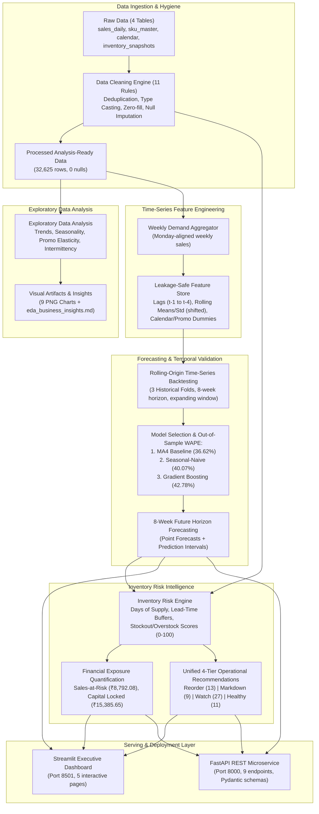

# PROJECT FORESIGHT — End-to-End System Architecture

## Architecture Overview

---

## Component Walkthrough

1. **Raw Data Ingestion:**
   * Ingests 4 relational synthetic enterprise tables representing NorthBay Living's retail ecosystem: `sales_daily.csv`, `sku_master.csv`, `calendar.csv`, and `inventory_snapshots.csv`.
2. **Data Cleaning (`src/data_cleaning.py`):**
   * Executes 11 automated cleaning rules: deduplication, zero-filling missing units, imputing revenue via unit price, clipping negative units, forward-filling inventory levels, and Title-casing categories.
   * Outputs `merged_analysis_ready.csv` (32,625 rows, 0 nulls) and `outputs/data_quality_report.md`.
3. **Exploratory Data Analysis (`notebooks/`):**
   * Computes demand trends, promotional lifts (+64.9% Kitchen, +60.9% Decor), seasonality heatmaps, price/margin distributions, inventory health, and demand sparsity/intermittency.
4. **Weekly Demand Aggregator & Feature Engineering (`src/feature_engineering.py`):**
   * Groups daily sales into Monday-aligned weekly buckets.
   * Creates lags (1–4 weeks), rolling means and standard deviations (4 and 8 weeks) with explicit `.shift(1)` to strictly prevent concurrent or future target leakage, alongside calendar and promotional features.
5. **Rolling-Origin Backtesting & Forecasting (`src/forecast.py`):**
   * Evaluates models across 3 expanding temporal folds (8-week test horizon per fold).
   * Models evaluated: Seasonal-Naive (52-week lag), 4-Week Moving Average baseline, and Gradient Boosting Regressor.
   * Generates 8-week future forecasts with parametric prediction intervals into `outputs/forecasts/forecast_8week.csv`.
6. **Inventory Risk Engine (`src/risk.py`):**
   * Calculates Days of Supply (DoS) against SKU-specific lead times (7–45 days).
   * Generates normalized 0–100 scores for Stockout Risk and Overstock Risk.
   * Classifies all 60 SKUs into 4 actionable operational categories: **Reorder** (13 SKUs), **Markdown** (9 SKUs), **Watch** (27 SKUs), and **Healthy** (11 SKUs).
   * Computes Rupee sales-at-risk (₹8,792.08) and excess working capital locked (₹15,385.65).
7. **Serving Layer (`app/streamlit_app.py` & `service/main.py`):**
   * **Streamlit:** 5-page interactive dashboard for supply chain planners and merchandise managers.
   * **FastAPI:** High-performance REST microservice with Pydantic v2 schemas and 9 operational endpoints.
